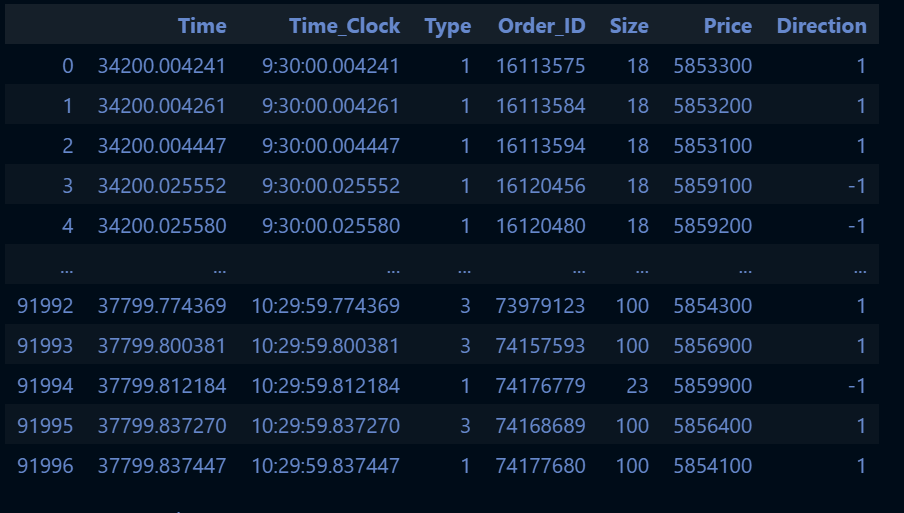
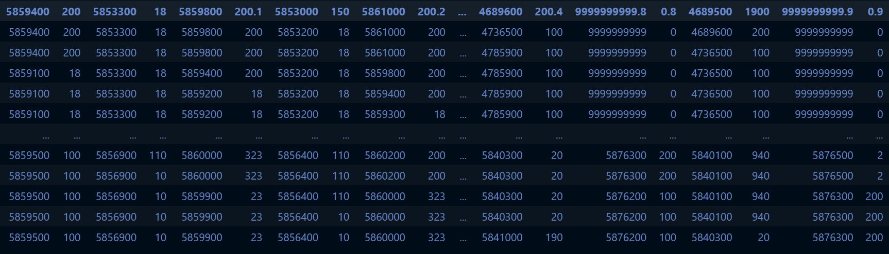
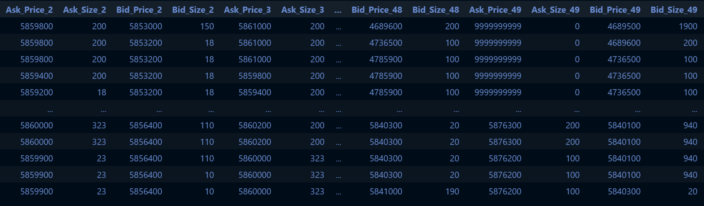

# LOBSTER CSV 

The function is usefull if you want to use the CSV files from the [LOBSTER website](https://lobsterdata.com/). The original files do not have any label for the columns, this function labels the dataframe using Pandas. The message file is straing foward to label, the order book it can be problematic because we have different CSV files to choose from depending on the order book depth (level 10,50 and so on). The function can take care of that automatically.

---

Message type:

Columns names: 'Time', 'Type', 'Order_ID', 'Size', 'Price', 'Direction'

---

Order Book type:

'Ask_Price_1',  'Ask_Size_1', 'Bid_Price_1',  'Bid_Size_1'

+ How the CSV Order Book file is presented originally
+ How the CSV Order Book file is presented after the function

  

---

Contact me for any issue.
